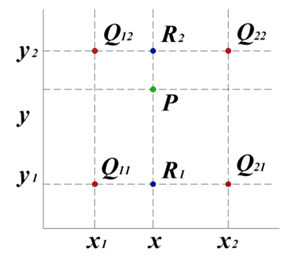

# TODO List

## 0 前期工作 Done√
**1.测试odb数据的获取，通过查资料和手册，了解odb数据的架构，明确【温度、应变、应力】的存储位置（每个节点上？积分点上？还是网格上？）和代码获取方式**

温度和位移储存在节点上，应力和应变储存在单元上

**2.获得最初和最后每个原始网格中节点的位置坐标**

可通过初始坐标+变形U来计算

**3.根据重新划分网格前的节点和数据，通过插值，计算网格划分后，各节点对应的数据。**

使用划分网格前的节点，构建八叉树，对划分网格后的节点，找到最近的8个点，使用插值计算目标节点的数据值。

## 1 knn算法当目标点过于接近包围边界的优化 Done√
判断点到边界距离最近的那个面是否为八叉树的外边界，如果是，则忽略这个距离在剩下几个面中选择最小的距离作为点到边界的最小距离

优化前后耗时对比

| 算法\点数 | 9340/9340 | 11295/11295 | 18080/9340 | 22496/11295 |
| --- | --- | --- | --- | --- |
| 暴力 | 73s | 103s | - | - |
| knn | 39s | 52s | - | - |
| 优化knn | 19s | 28s | 40s | 53s |

可以看出，knn在暴力遍历的基础上提升了100%的性能，而优化后的knn又在knn的基础上提升了100%的性能

## 2 阈值k的优化 Done√
用多个阈值k进行试验，判断效率最高的阈值

| k\数据量 | 22496/11295 | 18080/9340 |
| --- | --- | --- |
|6|53s|40s|
|8|55s|42s|
|10|55s|41s|
|12|55s|42s|
|14|55s|42s|
|16|55s|41s|
|18|55s|42s|
|20|55s|42s|

对k取多个值进行实验，发现不同的k对计算效率没有很大的影响

## 3 插值算法的选取 Done√
Abaqus内部使用二次/三次线性插值法求差值，如下所示

（此处公式待补充）

而该方法要求这4/8个差值点共面/形成一个六面体，而实际上用八叉树找到的8个最近邻点并不能满足这个要求，因此考虑反距离加权插值法

目标点离插值点的距离越远，受到该插值点参数的影响就越小，因此将距离取倒作为权重，这是反距离插值的理论依据。问题就回到了是以距离的倒数作为加权还是以距离平方的倒数做加权。直观上应该选用距离的倒数，但是用距离平方的倒数做加权，可以省掉一个开方的操作，效率更高。

因此随机生成一系列正方体，使用标准的三线性插值法计算插值，分别使用1/d、1/d^2、1/d^3作为插值权重，进行验证，其中d为目标点到差值点的距离。该部分代码见[interpolation.py](interpolation.py)。

| 加权系数 | 与三次线性插值的误差 | 10000次耗时 |
| --- | --- | --- |
|1/d|14.4%| 0.09s |
|1/d^2|6.7%| 0.08s |
|1/d^3|7.9%| 0.13S |

结果表明以距离平方的倒数作为插值权重，与三次线性插值法的误差最小，并且耗时最少。
